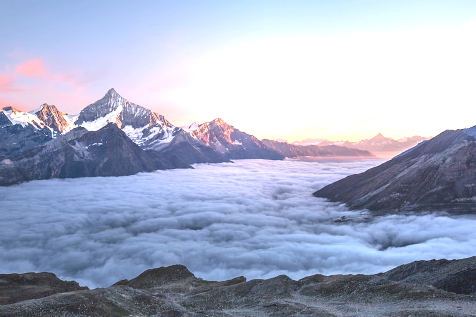
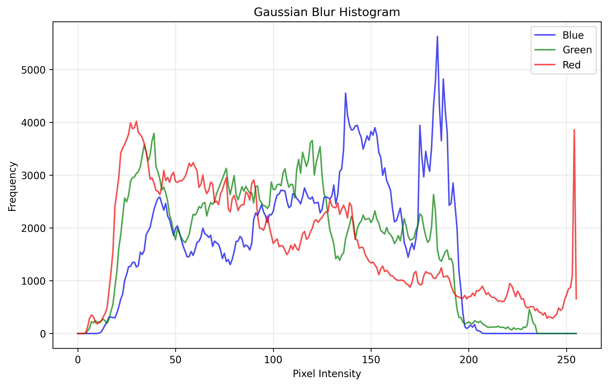
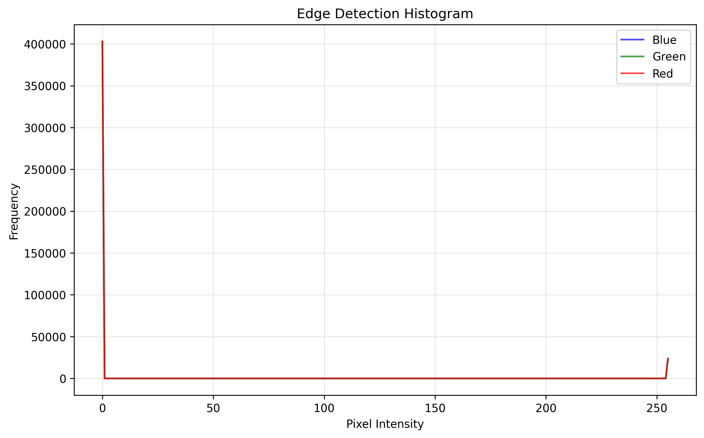
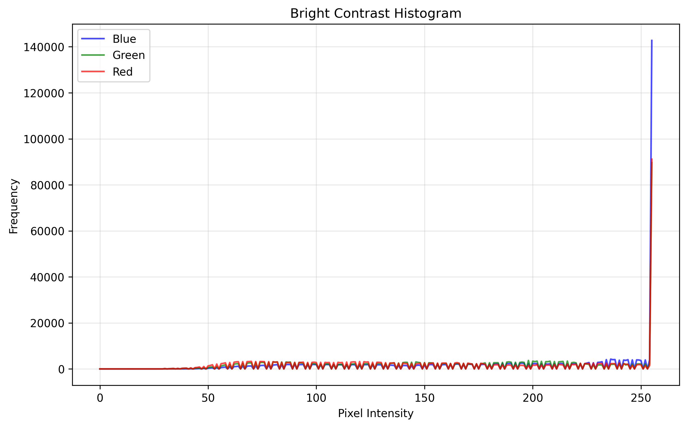

# 📊 Image Processing Analysis Results

Generated on: August 29, 2025  
Repository: Explore-the-rapid-prototype-in-AI-Project

## 🎨 Image Processing Filters Applied

### 1. Original Image

**Image Properties:**
- Dimensions: 400x600 pixels
- Color Space: RGB
- Generated using procedural gradient and geometric shapes

### 2. Gaussian Blur Filter

**Filter Settings:**
- Kernel Size: 15x15
- Effect: Smoothing and noise reduction

### 3. Edge Detection (Canny)

**Algorithm Parameters:**
- Lower Threshold: 50
- Upper Threshold: 150
- Result: Highlighted edges and contours

### 4. Brightness & Contrast Enhancement

**Enhancement Parameters:**
- Contrast Multiplier: 1.5x
- Brightness Offset: +30
- Result: Enhanced visibility and dynamic range

### 5. Median Blur Filter

**Filter Settings:**
- Kernel Size: 15x15
- Effect: Noise reduction while preserving edges

---

## 📈 Statistical Analysis Charts

### Color Distribution Histograms

These charts show the frequency distribution of pixel intensities for each color channel:

#### Original Image Histogram

#### Gaussian Blur Histogram  

#### Edge Detection Histogram

#### Brightness & Contrast Histogram

#### Median Blur Histogram

---

## 📊 Statistical Comparison Charts

These charts compare statistical measures (mean, standard deviation, min, max) between original and processed images:

### Gaussian Blur vs Original

### Edge Detection vs Original  

### Brightness & Contrast vs Original

### Median Blur vs Original

---

## 🎯 Interactive Visualization

For interactive exploration of intensity distributions across all filters, open:
📁 `demo_outputs/intensity_distribution.html`

This interactive plot allows you to:
- Toggle different image processing results
- Zoom and pan for detailed analysis  
- Compare intensity distributions side by side

---

## 🔢 Detailed Statistics Summary

### Original Image Statistics

| Channel | Mean  | Std Dev | Min | Max |
|---------|-------|---------|-----|-----|
| Blue    | 67.09 | 77.04   | 0   | 255 |
| Green   | 119.39| 86.16   | 0   | 255 |
| Red     | 145.66| 84.56   | 0   | 255 |

### Key Observations

1. **Color Distribution**: The image has more red and green components compared to blue, creating the gradient effect from blue to green.

2. **Filter Effects**:
   - **Gaussian Blur**: Reduces high-frequency details while maintaining overall color distribution
   - **Edge Detection**: Converts to binary-like output highlighting boundaries
   - **Brightness/Contrast**: Shifts mean values and expands dynamic range
   - **Median Blur**: Similar to Gaussian but better preserves edges

3. **Statistical Impact**:
   - Blur filters reduce standard deviation (less variation)
   - Edge detection dramatically changes distribution (binary-like)
   - Brightness/contrast adjustment shifts mean and affects range

---

## 🛠️ Technical Implementation

**Libraries Used:**
- OpenCV: Image processing operations
- NumPy: Numerical computations
- Matplotlib: Static plotting and histograms
- Plotly: Interactive visualizations
- Pillow: Image I/O operations

**Generated Files:**
- 6 PNG images (original + 5 processed)
- 5 histogram charts  
- 4 statistical comparison charts
- 1 interactive HTML plot
- 2 detailed reports

**Total Output Files:** 18 files demonstrating comprehensive image processing capabilities

---

*This analysis demonstrates the capabilities of the Image Processing Application developed with Streamlit and OpenCV.*
